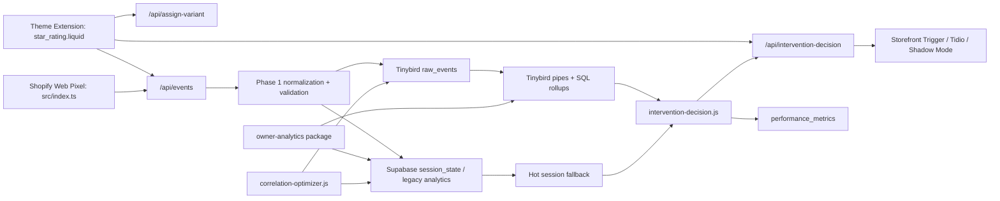

# Repository Architecture Map

## Scope

This map covers the authored repository surface that defines behavior:

- source code
- extension code
- backend routes
- shared analytics modules
- SQL, Tinybird, and Supabase schema files
- scripts
- tests
- top-level docs and config

It intentionally excludes local or generated noise that is not part of the system design:

- `node_modules/`
- `.git/`
- `.shopify/`
- `supabase/.temp/`
- `tinybird-analytics/tb_env/`
- `tinybird-analytics/.env.local`
- `extensions/**/.DS_Store`
- `extensions/behavioral-telemetry/dist/*`
- `.tinyb` secret-bearing local Tinybird profile contents

## System Graph



## Core Runtime Files

- [index.js](/Users/gabrielwong/Desktop/behavioral-pro/index.js) is the active Node entrypoint. It imports `startServer` from `app.js` and boots the Express server.
- [app.js](/Users/gabrielwong/Desktop/behavioral-pro/app.js) is the main backend orchestrator. It creates the Express app, validates Shopify auth and signed ingestion, normalizes store config, writes canonical events into Tinybird, mirrors compatibility analytics into Supabase, updates `session_state`, computes intervention decisions, logs `performance_metrics`, serves owner dashboards, store-config routes, timeline routes, health routes, and Shopify callback/webhook endpoints. It is the largest control-plane file and the main connection point between storefront telemetry, Supabase, and Tinybird.
- [src/app/api/intervention-decision/route.ts](/Users/gabrielwong/Desktop/behavioral-pro/src/app/api/intervention-decision/route.ts) is the Next route version of live decisioning. It rate-limits, bot-filters, optionally proxies to a pilot backend, otherwise calls the shared evaluator from `packages/analytics/src/intervention-decision.js`, then asynchronously logs `performance_metrics`.
- [src/app/api/feedback/route.ts](/Users/gabrielwong/Desktop/behavioral-pro/src/app/api/feedback/route.ts) is a Next route that validates feedback submissions with Zod and inserts rows into Supabase `feedback`.
- [src/components/FeedbackCard.tsx](/Users/gabrielwong/Desktop/behavioral-pro/src/components/FeedbackCard.tsx) is the Polaris feedback modal. It collects a feedback type and description, automatically adds route and shop context, and posts to `/api/feedback`.

## Shared Analytics Package

- [packages/analytics/package.json](/Users/gabrielwong/Desktop/behavioral-pro/packages/analytics/package.json) defines the shared analytics workspace package and exports `src/index.js`.
- [packages/analytics/README.md](/Users/gabrielwong/Desktop/behavioral-pro/packages/analytics/README.md) documents the analytics package purpose and usage.
- [packages/analytics/src/index.js](/Users/gabrielwong/Desktop/behavioral-pro/packages/analytics/src/index.js) is the shared legacy/session analytics engine. It supports file-backed and Supabase-backed execution, tracks sessions and raw events, deduplicates purchases and event keys, synthesizes analytics rows from `session_state` when event tables are sparse, builds CRO tables, computes conversion summaries, and feeds owner dashboards and merchant metrics.
- [packages/analytics/src/metrics-payload.js](/Users/gabrielwong/Desktop/behavioral-pro/packages/analytics/src/metrics-payload.js) converts an analytics overview into merchant-facing summaries for `control`, `variant`, `exposed`, and `unexposed`, plus `lift_percent`, `exposure_lift_percent`, `incremental_revenue_estimate`, and `exposure_rate`.
- [packages/analytics/src/event-spine.js](/Users/gabrielwong/Desktop/behavioral-pro/packages/analytics/src/event-spine.js) is the canonical event contract. It defines `PHASE1_EVENT_NAMES`, validates payload shape, sanitizes `session_frame` metadata, creates canonical event records, creates assignment events, generates event IDs, and maps some canonical events back into older compatibility event names.
- [packages/analytics/src/behavioral-event-contract.js](/Users/gabrielwong/Desktop/behavioral-pro/packages/analytics/src/behavioral-event-contract.js) is a stricter storefront input contract helper. It validates snake_case event payloads before they become behavioral event objects.
- [packages/analytics/src/request-security.js](/Users/gabrielwong/Desktop/behavioral-pro/packages/analytics/src/request-security.js) handles public-route safety. It validates event payloads and intervention query params, enforces payload-size limits, bounds timestamps, sanitizes `session_frame` objects, validates shop domains and URLs, builds in-memory rate-limit keys, and detects bot-like traffic.
- [packages/analytics/src/session-frame.js](/Users/gabrielwong/Desktop/behavioral-pro/packages/analytics/src/session-frame.js) is the backend `session_frame` sanitizer and signal extractor. It rejects sensitive fields, clamps numeric telemetry, and derives immediately usable decision inputs like `mouse_velocity_drop_near_cta`, `rage_click_recent`, `dead_click_recent`, `idle_near_cta`, `near_cta`, `page_type`, `active_zone`, and recent raw frame values.
- [packages/analytics/src/session-features-sql.js](/Users/gabrielwong/Desktop/behavioral-pro/packages/analytics/src/session-features-sql.js) generates Tinybird SQL for session rollups. It builds the dedupe CTE over `raw_events` and the final `session_features` select used for health checks and analytics inspection.
- [packages/analytics/src/tinybird.js](/Users/gabrielwong/Desktop/behavioral-pro/packages/analytics/src/tinybird.js) wraps Tinybird host resolution, token resolution, event-ingest URL creation, SQL query POSTs, JSON parsing, failure logging, and SQL string escaping.
- [packages/analytics/src/intervention-decision.js](/Users/gabrielwong/Desktop/behavioral-pro/packages/analytics/src/intervention-decision.js) is the live decision engine. It normalizes store config, maintains hot in-memory session state, rebuilds session features from Supabase `session_state`, falls back to Tinybird SQL when needed, loads store benchmarks, blends cohort defaults with store history, recomputes dynamic `session_frame` scores from raw recent telemetry, evaluates intervention rules, applies store-config filters and cooldowns, and returns `decision`, `strategy`, `intervention_type`, `message_id`, `shadow_mode`, `session_score`, and nested `metadata`.
- [packages/analytics/src/state-inference.js](/Users/gabrielwong/Desktop/behavioral-pro/packages/analytics/src/state-inference.js) is passive reference logic only. It preserves the older boolean heuristic model for snapshot tests: `productDwell12s`, `reviewDwell10s`, `addToCart`, `couponFieldFocus`, and `checkoutBack`.
- [packages/analytics/src/workers/correlation-optimizer.js](/Users/gabrielwong/Desktop/behavioral-pro/packages/analytics/src/workers/correlation-optimizer.js) is the nightly adaptive-weight worker. It queries Tinybird for the last 30 days of non-intervened sessions, computes point-biserial correlations between behavioral peaks and `abandoned`, scales the baseline multipliers, and writes `settings.dynamic_multipliers` back into Supabase `stores`.

## Prototype / Non-Production Analytics Files

- [packages/analytics/src/prototypes/README.md](/Users/gabrielwong/Desktop/behavioral-pro/packages/analytics/src/prototypes/README.md) marks the prototype folder as non-production.
- [packages/analytics/src/prototypes/decision-models-registry.js](/Users/gabrielwong/Desktop/behavioral-pro/packages/analytics/src/prototypes/decision-models-registry.js) defines plain record builders for experimental model metadata and scores.
- [packages/analytics/src/prototypes/logistic-regression-evaluate.js](/Users/gabrielwong/Desktop/behavioral-pro/packages/analytics/src/prototypes/logistic-regression-evaluate.js) evaluates a logistic regression prototype with `sigmoid`, feature-vector construction, and thresholded `decision`. It is not part of the live route.

## Owner Analytics Package

- [packages/owner-analytics/package.json](/Users/gabrielwong/Desktop/behavioral-pro/packages/owner-analytics/package.json) defines the owner analytics package.
- [packages/owner-analytics/src/index.js](/Users/gabrielwong/Desktop/behavioral-pro/packages/owner-analytics/src/index.js) builds the owner-only dashboard HTML and registers owner routes for listing stores, viewing analytics overview, metrics, conversion rates, session CRO tables, raw events, and raw session JSON. It depends on the shared analytics package and `ANALYTICS_OWNER_TOKEN`.

## Storefront Theme Extension

- [extensions/behavior-pro/shopify.extension.toml](/Users/gabrielwong/Desktop/behavioral-pro/extensions/behavior-pro/shopify.extension.toml) declares the theme app extension.
- [extensions/behavior-pro/locales/en.default.json](/Users/gabrielwong/Desktop/behavioral-pro/extensions/behavior-pro/locales/en.default.json) contains the theme extension translation strings.
- [extensions/behavior-pro/snippets/stars.liquid](/Users/gabrielwong/Desktop/behavioral-pro/extensions/behavior-pro/snippets/stars.liquid) is a small star-display snippet that renders filled and empty stars from a rating.
- [extensions/behavior-pro/assets/thumbs-up.png](/Users/gabrielwong/Desktop/behavioral-pro/extensions/behavior-pro/assets/thumbs-up.png) is a static image asset used by the theme extension.
- [extensions/behavior-pro/blocks/star_rating.liquid](/Users/gabrielwong/Desktop/behavioral-pro/extensions/behavior-pro/blocks/star_rating.liquid) is the main storefront runtime. It:
  - initializes variant/session/visitor IDs
  - loads store config from `/api/public-storefront-config/:shop_domain`
  - assigns variants via `/api/assign-variant`
  - emits behavioral `trackEvent(...)` payloads to `/api/events`
  - maintains client dedupe maps
  - computes `session_frame` scores from DOM telemetry
  - streams `session_frame` events every 2 seconds
  - calls `/api/intervention-decision`
  - applies a 3-strike circuit breaker and silent fallback
  - snapshots cart contents for recovery
  - resolves backend `message_id` values into Tidio message copy
  - opens Tidio or review-mode UI when the backend says yes

### Key `star_rating.liquid` subsystems

- motion intent tracker: `startPackedMotionTracking()`
- `session_frame` telemetry: `startSessionFrameTelemetry()`, `sendSessionFrame()`, `buildFrameScores(...)`
- event tracking: `bindEventTracking()`, `trackPageEvents()`, `bindScrollDepthTracking()`, `bindExitIntentTracking()`, dwell/idle timers
- decision loop: `shouldIntervene()`, `scheduleDecisionCheck()`
- UI handoff: `maybeTriggerBehavioralUi()`, `loadTidio()`, `showFallbackUi()`
- resiliency: `parseFailureCount()`, `recordDecisionFailure()`, `reportCircuitBreakerTrip()`

## Shopify Web Pixel + Lightweight Storefront Helper

- [extensions/behavioral-telemetry/package.json](/Users/gabrielwong/Desktop/behavioral-pro/extensions/behavioral-telemetry/package.json) defines the web pixel extension package.
- [extensions/behavioral-telemetry/shopify.extension.toml](/Users/gabrielwong/Desktop/behavioral-pro/extensions/behavioral-telemetry/shopify.extension.toml) declares the web pixel extension and its `accountID` setting.
- [extensions/behavioral-telemetry/README.md](/Users/gabrielwong/Desktop/behavioral-pro/extensions/behavioral-telemetry/README.md) documents the pixel package.
- [extensions/behavioral-telemetry/src/index.ts](/Users/gabrielwong/Desktop/behavioral-pro/extensions/behavioral-telemetry/src/index.ts) is the Shopify Web Pixel runtime. It subscribes to `all_events`, maps Shopify analytics names into the canonical behavioral names, hydrates visitor/session IDs in browser storage, and posts those events to `/api/events`.
- [extensions/behavioral-telemetry/src/storefront-trigger.ts](/Users/gabrielwong/Desktop/behavioral-pro/extensions/behavioral-telemetry/src/storefront-trigger.ts) is the lightweight browser helper that:
  - fetches `/api/intervention-decision` with a 1000ms timeout
  - applies the same 3-strike sessionStorage circuit breaker as the Liquid script
  - logs `shadow_intervention_logged`
  - resolves `message_id` values into Tidio copy
  - snapshots cart contents on `cart_abandonment_detected`
  - listens to `window.tidioChatApi` visitor messages for recovery intent
  - restores saved items to Shopify `/cart/add.js` and reloads the page

## Root and Workspace Config

- [package.json](/Users/gabrielwong/Desktop/behavioral-pro/package.json) is the monorepo root manifest. It defines workspaces, dependencies, runtime scripts, test scripts, and the new `optimize:correlations` worker entry.
- [package-lock.json](/Users/gabrielwong/Desktop/behavioral-pro/package-lock.json) is the dependency lockfile for reproducible npm installs.
- [.gitignore](/Users/gabrielwong/Desktop/behavioral-pro/.gitignore) ignores env files, builds, caches, logs, and `node_modules`.
- [.npmrc](/Users/gabrielwong/Desktop/behavioral-pro/.npmrc) enforces strict Node engine checks and npm peer-install behavior.
- [.graphqlrc.js](/Users/gabrielwong/Desktop/behavioral-pro/.graphqlrc.js) discovers Shopify extension schemas and configures GraphQL tooling per extension.
- [.vscode/extensions.json](/Users/gabrielwong/Desktop/behavioral-pro/.vscode/extensions.json) recommends the VS Code GraphQL extension.
- [.vscode/mcp.json](/Users/gabrielwong/Desktop/behavioral-pro/.vscode/mcp.json) configures the local Shopify Dev MCP server for editor tooling.
- [.env.example](/Users/gabrielwong/Desktop/behavioral-pro/.env.example) is the local validation env template for backend base, Tinybird, and Supabase credentials.
- [index](/Users/gabrielwong/Desktop/behavioral-pro/index) is an old archived Express server snapshot kept as a plain backup file.
- [index.backup.js](/Users/gabrielwong/Desktop/behavioral-pro/index.backup.js) is another historical server backup snapshot.
- [index.js.save](/Users/gabrielwong/Desktop/behavioral-pro/index.js.save) is a saved entrypoint snapshot.
- [extensions/.gitkeep](/Users/gabrielwong/Desktop/behavioral-pro/extensions/.gitkeep) preserves the `extensions/` directory in Git.

## Shopify App Config

- [shopify.app.toml](/Users/gabrielwong/Desktop/behavioral-pro/shopify.app.toml) defines one Shopify app registration pointing at the Railway backend, with redirect URLs and compliance webhooks.
- [shopify.app.behavioralpro.toml](/Users/gabrielwong/Desktop/behavioral-pro/shopify.app.behavioralpro.toml) defines the main BehavioralPro embedded app registration used for production-style deploys.
- [shopify.app.behavioralpro-public.toml](/Users/gabrielwong/Desktop/behavioral-pro/shopify.app.behavioralpro-public.toml) defines a public-app-style registration pointing at Shopify’s default app home.

## Supabase Schema

- [supabase/migrations/20260520_create_session_state.sql](/Users/gabrielwong/Desktop/behavioral-pro/supabase/migrations/20260520_create_session_state.sql) creates `session_state`, indexes, and the `merge_session_state_counters` / `upsert_session_state_counters` RPC for hot-session aggregation.
- [supabase/migrations/20260521_extend_stores_for_dashboard_controls.sql](/Users/gabrielwong/Desktop/behavioral-pro/supabase/migrations/20260521_extend_stores_for_dashboard_controls.sql) adds `settings`, `last_event_at`, and `last_decision_at` to `stores`.
- [supabase/migrations/202605220001_create_performance_metrics.sql](/Users/gabrielwong/Desktop/behavioral-pro/supabase/migrations/202605220001_create_performance_metrics.sql) creates `performance_metrics` for route performance and decision auditing.
- [supabase/migrations/202605220002_create_store_benchmarks.sql](/Users/gabrielwong/Desktop/behavioral-pro/supabase/migrations/202605220002_create_store_benchmarks.sql) creates `store_benchmarks` for dynamic decision thresholds.
- [supabase/migrations/202605220003_add_performance_metrics_outcome_status.sql](/Users/gabrielwong/Desktop/behavioral-pro/supabase/migrations/202605220003_add_performance_metrics_outcome_status.sql) adds `outcome_status`, `response_status_code`, and a supporting index.
- [supabase/migrations/202605220004_add_performance_metrics_rollout_columns.sql](/Users/gabrielwong/Desktop/behavioral-pro/supabase/migrations/202605220004_add_performance_metrics_rollout_columns.sql) adds rollout metadata columns `pilot_cohort` and `rollout_key`.
- [supabase/migrations/202605220005_add_performance_metrics_runtime_columns.sql](/Users/gabrielwong/Desktop/behavioral-pro/supabase/migrations/202605220005_add_performance_metrics_runtime_columns.sql) adds `route_runtime` and `deployment_version`.
- [supabase/migrations/202605230001_create_feedback.sql](/Users/gabrielwong/Desktop/behavioral-pro/supabase/migrations/202605230001_create_feedback.sql) creates the `feedback` table and indexes.
- [supabase/migrations/202605260001_harden_public_supabase_objects.sql](/Users/gabrielwong/Desktop/behavioral-pro/supabase/migrations/202605260001_harden_public_supabase_objects.sql) turns on RLS, revokes public access, and grants execute access to only the service role for backend-only tables and RPCs.
- [supabase/migrations/202606040001_add_session_frame_signals.sql](/Users/gabrielwong/Desktop/behavioral-pro/supabase/migrations/202606040001_add_session_frame_signals.sql) adds `signals` to `session_state`, adds `merge_session_state_signals`, and expands `upsert_session_state_counters` to merge raw `session_frame` signal updates.

## Tinybird Project Files

- [tinybird-analytics/ENGINE_MAP.md](/Users/gabrielwong/Desktop/behavioral-pro/tinybird-analytics/ENGINE_MAP.md) documents the Tinybird data model and pipeline intent.
- [tinybird-analytics/.gitignore](/Users/gabrielwong/Desktop/behavioral-pro/tinybird-analytics/.gitignore) ignores local Tinybird env artifacts.
- [tinybird-analytics/datasources/raw_events.datasource](/Users/gabrielwong/Desktop/behavioral-pro/tinybird-analytics/datasources/raw_events.datasource) defines the canonical `raw_events` ingestion schema for Tinybird.
- [tinybird-analytics/datasources/storefront_events_example.datasource](/Users/gabrielwong/Desktop/behavioral-pro/tinybird-analytics/datasources/storefront_events_example.datasource) defines a sample datasource used by demo or experimental analytics.
- [tinybird-analytics/pipes/v1_session_features.pipe](/Users/gabrielwong/Desktop/behavioral-pro/tinybird-analytics/pipes/v1_session_features.pipe) is the larger endpoint pipe that turns raw deduped events into rich session features, objective counts, timing metrics, and abandonment flags.
- [tinybird-analytics/pipes/v1_session_features_by_session.pipe](/Users/gabrielwong/Desktop/behavioral-pro/tinybird-analytics/pipes/v1_session_features_by_session.pipe) is the narrower per-session endpoint used as a fallback current-session read model.
- [tinybird-analytics/pipes/v1_session_features.sql](/Users/gabrielwong/Desktop/behavioral-pro/tinybird-analytics/pipes/v1_session_features.sql) is the plain SQL version of the per-session pipe.
- [tinybird-analytics/pipes/abandonment_by_variant.pipe](/Users/gabrielwong/Desktop/behavioral-pro/tinybird-analytics/pipes/abandonment_by_variant.pipe) is a small example endpoint computing abandonment rates by variant from the example datasource.
- [tinybird-analytics/generator.py](/Users/gabrielwong/Desktop/behavioral-pro/tinybird-analytics/generator.py) generates and batches mock session data into Tinybird for experimentation.
- [tinybird-analytics/local_analytics.py](/Users/gabrielwong/Desktop/behavioral-pro/tinybird-analytics/local_analytics.py) creates synthetic local session data and runs exploratory statsmodels logistic regression / chi-square analysis.

## Tinybird Local Skill / Tooling Files

- [tinybird-analytics/.agents/skills/tinybird/SKILL.md](/Users/gabrielwong/Desktop/behavioral-pro/tinybird-analytics/.agents/skills/tinybird/SKILL.md) and [tinybird-analytics/.agents/skills/tinybird-cli-guidelines/SKILL.md](/Users/gabrielwong/Desktop/behavioral-pro/tinybird-analytics/.agents/skills/tinybird-cli-guidelines/SKILL.md) plus their `rules/` files are local agent skill guides for working with Tinybird. They document conventions rather than runtime logic.

## Scripts

- [scripts/simulate-phase1-session.js](/Users/gabrielwong/Desktop/behavioral-pro/scripts/simulate-phase1-session.js) assigns a variant and sends a canonical event sequence to the local or configured backend.
- [scripts/check-session-features.js](/Users/gabrielwong/Desktop/behavioral-pro/scripts/check-session-features.js) queries Tinybird session-feature rows, store coverage, and fallback shop-domain coverage for operational inspection.
- [scripts/validate-session-features.js](/Users/gabrielwong/Desktop/behavioral-pro/scripts/validate-session-features.js) pushes known session sequences, polls Tinybird until rows appear, and asserts expected session feature values.
- [scripts/validate-live-intervention.js](/Users/gabrielwong/Desktop/behavioral-pro/scripts/validate-live-intervention.js) exercises assignment, event ingest, decision response, and public storefront config for a single live session.
- [scripts/run-launch-validation.js](/Users/gabrielwong/Desktop/behavioral-pro/scripts/run-launch-validation.js) is the broadest operational validation harness. It creates sessions, sends events, polls decisions, inspects `session_state`, fetches analytics overview, toggles store settings, and checks public config responses.
- [scripts/create-web-pixel-oauth.js](/Users/gabrielwong/Desktop/behavioral-pro/scripts/create-web-pixel-oauth.js) is a standalone OAuth helper that runs a local callback server, exchanges a Shopify auth code for an access token, and creates a web pixel via GraphQL.

## Data Fixtures

- [packages/analytics/data/raw-events.json](/Users/gabrielwong/Desktop/behavioral-pro/packages/analytics/data/raw-events.json) is the file-backed raw event fixture.
- [packages/analytics/data/checkouts.json](/Users/gabrielwong/Desktop/behavioral-pro/packages/analytics/data/checkouts.json) is the file-backed checkout fixture.
- [packages/analytics/data/triggers.json](/Users/gabrielwong/Desktop/behavioral-pro/packages/analytics/data/triggers.json) is the file-backed trigger fixture.
- [packages/analytics/data/session-cro.json](/Users/gabrielwong/Desktop/behavioral-pro/packages/analytics/data/session-cro.json) is the file-backed CRO session fixture.

## Tests

- [tests/helpers/mock-supabase.js](/Users/gabrielwong/Desktop/behavioral-pro/tests/helpers/mock-supabase.js) is the in-memory Supabase stand-in used by nearly every test. It supports `select`, `insert`, `upsert`, and the `upsert_session_state_counters` RPC behavior.
- [tests/analytics.test.js](/Users/gabrielwong/Desktop/behavioral-pro/tests/analytics.test.js) verifies the shared analytics package, purchase dedupe, `session_state` augmentation, and revenue carry-through.
- [tests/app-routes.test.js](/Users/gabrielwong/Desktop/behavioral-pro/tests/app-routes.test.js) covers Express app construction, helper functions, Tinybird-backed health reporting, session timeline extraction, and async performance log scheduling.
- [tests/auth.test.js](/Users/gabrielwong/Desktop/behavioral-pro/tests/auth.test.js) verifies Shopify session token validation and signed ingestion request expiry behavior.
- [tests/behavioral-event-contract.test.js](/Users/gabrielwong/Desktop/behavioral-pro/tests/behavioral-event-contract.test.js) tests the strict storefront event contract helper.
- [tests/events-phase1.test.js](/Users/gabrielwong/Desktop/behavioral-pro/tests/events-phase1.test.js) covers canonical Phase 1 event ingestion, assignment events, Tinybird forwarding, and event dedupe by `event_id`.
- [tests/intervention-chaos.test.js](/Users/gabrielwong/Desktop/behavioral-pro/tests/intervention-chaos.test.js) stress-tests fail-closed behavior under Tinybird 500s, Supabase 403s, and delayed no-data reads.
- [tests/intervention-decision.test.js](/Users/gabrielwong/Desktop/behavioral-pro/tests/intervention-decision.test.js) covers hot session-state precedence, `session_frame` signals, cooldown behavior, benchmark loading, and the new dynamic multiplier recompute path.
- [tests/correlation-optimizer.test.js](/Users/gabrielwong/Desktop/behavioral-pro/tests/correlation-optimizer.test.js) covers point-biserial correlation, baseline fallback under low sample counts, and Supabase persistence of optimized multipliers.
- [tests/request-security.test.js](/Users/gabrielwong/Desktop/behavioral-pro/tests/request-security.test.js) verifies public payload validation, route rate limiting, query validation, and some evaluator invariants like cold-start behavior.
- [tests/session-features-sql.test.js](/Users/gabrielwong/Desktop/behavioral-pro/tests/session-features-sql.test.js) validates that the generated session SQL includes dedupe, objective counts, and the expected read-model columns.
- [tests/session-frame.test.js](/Users/gabrielwong/Desktop/behavioral-pro/tests/session-frame.test.js) verifies `session_frame` sanitization, sensitive-field rejection, and immediate signal extraction.
- [tests/state-inference.test.js](/Users/gabrielwong/Desktop/behavioral-pro/tests/state-inference.test.js) keeps the passive heuristic snapshot behavior stable.
- [tests/stress.test.js](/Users/gabrielwong/Desktop/behavioral-pro/tests/stress.test.js) runs a concurrency-heavy multi-store analytics scenario.

## Documentation Files

- [README.md](/Users/gabrielwong/Desktop/behavioral-pro/README.md) is still mostly the upstream Shopify extension-only app template README.
- [SECURITY.md](/Users/gabrielwong/Desktop/behavioral-pro/SECURITY.md) is the Shopify security disclosure policy template.
- [ARCHITECTURE.md](/Users/gabrielwong/Desktop/behavioral-pro/ARCHITECTURE.md) is the existing hand-written system architecture document focused on runtime boundaries, event state vs control state, and environment dependencies.
- [LIVE_VALIDATION.md](/Users/gabrielwong/Desktop/behavioral-pro/LIVE_VALIDATION.md) explains how to run the live validation scripts and what each one proves.

## Route Inventory Anchors

These are the main Express and Next route entrypoints in the repo:

```txt
app.js
  POST /api/stores
  GET  /api/public-storefront-config/:shop_domain
  GET  /api/store-config/:shop_domain
  PUT  /api/store-config/:shop_domain
  POST /api/assign-variant
  POST /api/events
  GET|POST /api/intervention-decision
  GET  /api/sessions/:session_id/timeline
  GET  /api/analytics/conversion-rates/:shop_domain
  GET  /api/analytics/abandonment-by-variant
  GET  /api/metrics/:shop_domain
  GET  /api/debug/:shop_domain
  GET  /owner-dashboard
  GET  /api/admin/session-features-health
  GET  /api/owner/*
  GET  /api/shopify/callback

src/app/api/intervention-decision/route.ts
  GET /api/intervention-decision

src/app/api/feedback/route.ts
  POST /api/feedback
```

## Most Important Connection Points

- `star_rating.liquid` is the richest behavior producer.
- `extensions/behavioral-telemetry/src/index.ts` is the Shopify event producer.
- `app.js` is the ingestion/orchestration server.
- `packages/analytics/src/intervention-decision.js` is the live scoring and rule engine.
- `packages/analytics/src/workers/correlation-optimizer.js` is the nightly adaptive weight tuner.
- `raw_events.datasource` + `v1_session_features.pipe` are the main Tinybird read-model pipeline.
- `session_state` is the hot-session Supabase fallback and compatibility store.
- `store_benchmarks` and `stores.settings` are the per-store decision-config inputs.
